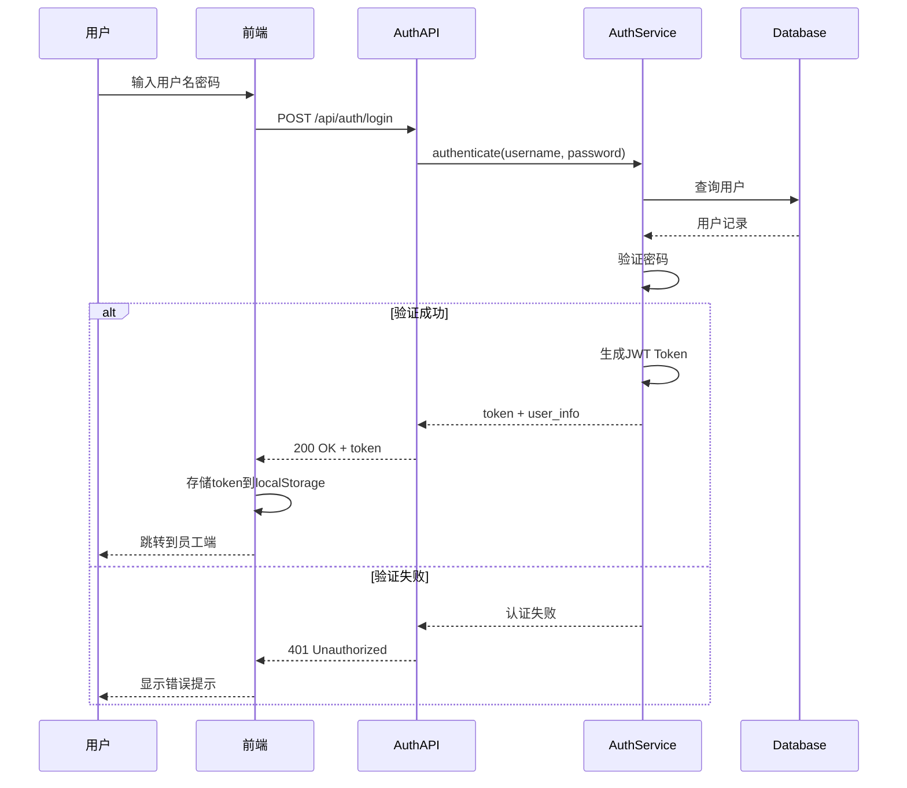
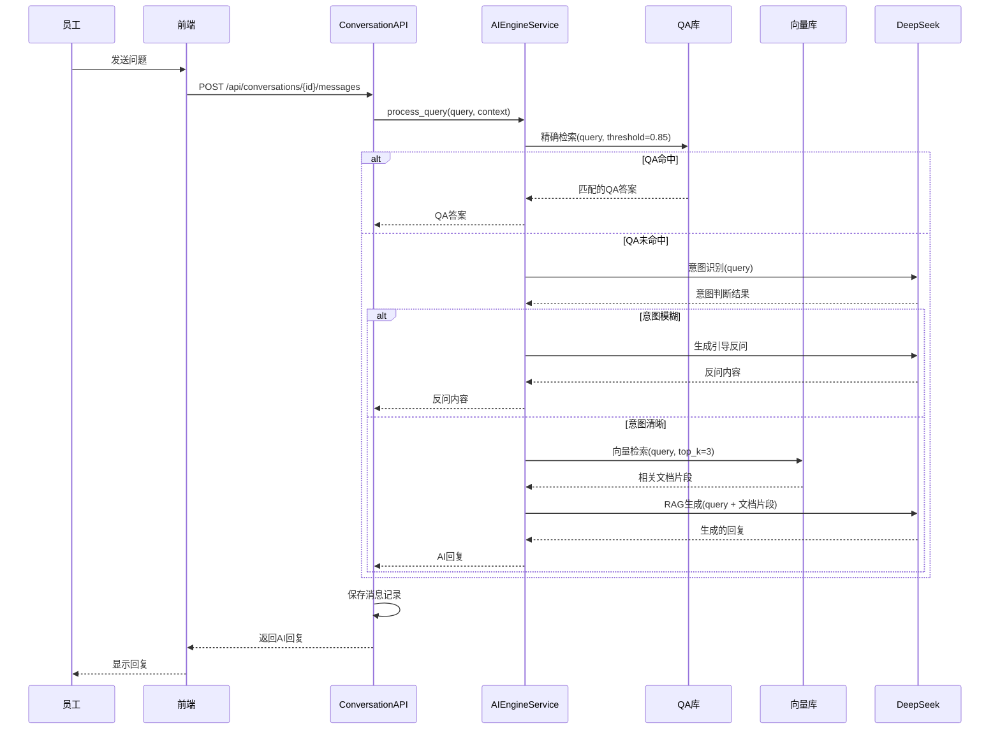
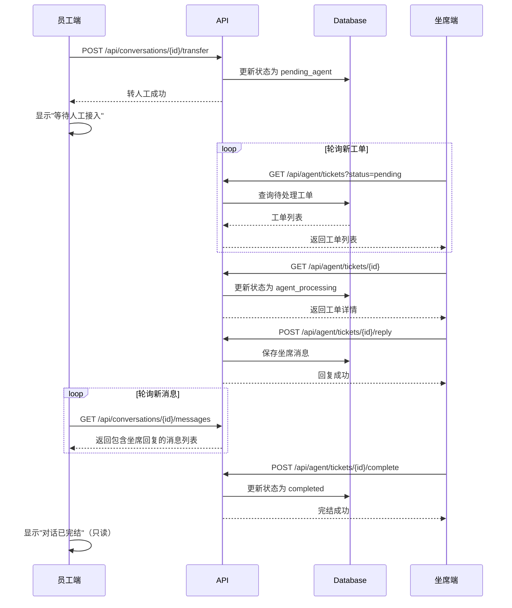
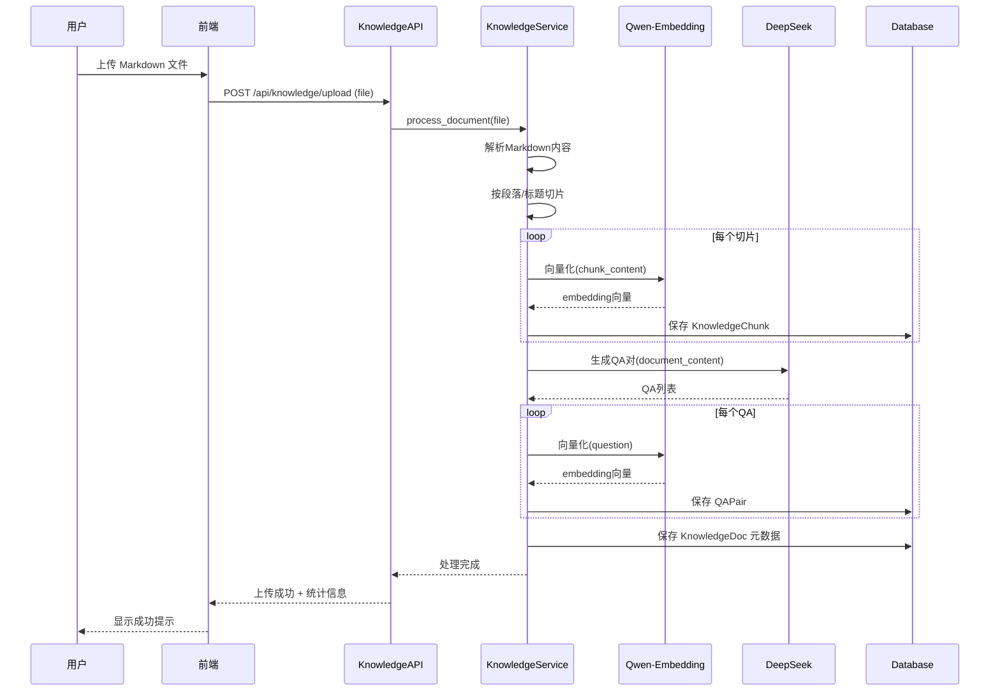

# 智能客服填单系统 - 产品需求文档 (PRD)

> **版本**: V1.0.0 (MVP)  
> **创建日期**: 2026-02-07  
> **设计方案**: 方案 B - 现代卡片式布局  

---

## 一、产品路线图 (Product Roadmap)

### 1.1 核心目标 (Mission)

**构建一套智能客服填单系统，让内部员工能够快速获得AI辅助解答，必要时无缝转接人工坐席，并通过质检闭环持续优化服务质量。**

### 1.2 用户画像 (Persona)

| 角色 | 描述 | 核心诉求 |
|------|------|----------|
| **内部员工** | 公司内部人员，遇到问题需要咨询 | 快速获得准确答案，复杂问题能转人工 |
| **坐席客服** | 处理转人工工单的客服人员 | 高效处理工单，有AI辅助生成回复 |
| **质检员** | 对已完成工单进行质量评估 | 快速评分，发现服务问题 |
| **知识管理员** | 维护知识库内容 | 方便上传文档，自动生成QA |

> **MVP 阶段**：单一账号（admin/123456），不区分角色权限，同一账号可访问所有功能模块。

### 1.3 V1: 最小可行产品 (MVP) 功能清单

| 模块 | 功能 | 优先级 | 说明 |
|------|------|--------|------|
| **登录模块** | 账号密码登录 | P0 | 测试账号 admin/123456 |
| **员工端** | 创建新对话 | P0 | 每次创建生成新工单 |
| | 发送消息，获取AI智能回复 | P0 | 核心对话功能 |
| | 查看历史对话列表 | P0 | 标记完成状态 |
| | 转人工按钮 | P0 | 触发工单状态变更 |
| **AI对话引擎** | 意图识别 + Query改写 | P0 | 模糊问题触发反问，清晰问题改写 |
| | 检索知识库 | P0 | QA库+向量库统一检索 |
| | 召回切片 + RAG生成 | P0 | 统一走模型问答输出 |
| **坐席端** | 工单列表（三状态筛选） | P0 | 未解决/解决中/已解决 |
| | 查看并回复工单 | P0 | 与员工端同步 |
| | 智能回答辅助 | P0 | 基于对话生成建议 |
| | 完结填单 | P0 | 填写结案摘要 |
| **质检端** | 已完成工单列表 | P0 | 待质检工单 |
| | 多维度评分 | P0 | 4维度1-5分 |
| **知识库管理** | 上传Markdown文件 | P0 | 拖拽上传 |
| | 自动切片 + 向量化 | P0 | 入库即可用 |
| | 自动生成QA对 | P0 | 同步构建 |
| | 查看/删除知识条目 | P1 | 管理已有数据 |

### 1.4 V2 及以后版本 (Future Releases)

| 版本 | 功能 | 说明 |
|------|------|------|
| V2 | WebSocket 实时通信 | 替换轮询，提升实时性 |
| V2 | 多角色权限体系 | 区分员工/坐席/质检/管理员 |
| V2 | 工单自动分配 | 根据负载智能分配给坐席 |
| V2 | 质检报表与统计 | 可视化质检数据分析 |
| V3 | 多租户支持 | 支持多部门/多公司隔离 |
| V3 | 知识库版本管理 | 支持回滚、对比 |
| V3 | 对话满意度评价 | 员工对服务进行评价 |

---

## 二、关键业务逻辑 (Business Rules)

### 2.1 工单状态流转

工单遵循固定流程，不可跳跃或回退：

```
┌─────────────┐    ┌─────────────┐    ┌─────────────┐
│   created   │───▶│ai_processing│───▶│pending_agent│
│  (员工创建) │    │  (AI对话中) │    │  (转人工)   │
└─────────────┘    └─────────────┘    └──────┬──────┘
                                             │
                   ┌─────────────┐           │
                   │  reviewed   │◀──────────┤
                   │  (已质检)   │           │
                   └─────────────┘           ▼
                         ▲           ┌─────────────┐
                         │           │   agent_    │
                         │           │  processing │
                   ┌─────────────┐   │ (坐席处理) │
                   │  completed  │◀──┴─────────────┘
                   │  (已完结)   │
                   └─────────────┘
```

| 状态 | 英文标识 | 触发条件 | 可执行操作 |
|------|----------|----------|------------|
| 已创建 | `created` | 员工发起新对话 | 员工发消息 |
| AI处理中 | `ai_processing` | 首条消息发送后 | 员工发消息、AI回复、转人工 |
| 待接单 | `pending_agent` | 员工点击转人工 | 等待坐席查看 |
| 坐席处理中 | `agent_processing` | 坐席打开工单 | 坐席回复、员工回复、完结 |
| 已完结 | `completed` | 坐席点击完结 | 员工只读、等待质检 |
| 已质检 | `reviewed` | 质检完成评分 | 全员只读（归档） |

### 2.2 员工端 RAG 全流程

```
                    ┌─────────────────┐
                    │   用户发送Query │
                    └────────┬────────┘
                             ▼
                    ┌─────────────────┐
                    │     意图识别    │
                    └────────┬────────┘
                             │
              ┌──────────────┴──────────────┐
              │ 意图模糊               意图清晰│
              ▼                               ▼
     ┌─────────────────┐           ┌─────────────────┐
     │  触发引导反问   │           │   Query改写     │
     │ (请求更多细节)  │           │(检索友好表达)   │
     └─────────────────┘           └────────┬────────┘
                                            ▼
                                   ┌─────────────────┐
                                   │   检索知识库    │
                                   │ QA库+向量库检索 │
                                   └────────┬────────┘
                                            ▼
                                   ┌─────────────────┐
                                   │   召回切片TopK  │
                                   └────────┬────────┘
                                            ▼
                                   ┌─────────────────┐
                                   │   模型问答RAG   │
                                   │ (统一生成回复)  │
                                   └─────────────────┘
```

**关键参数**:
- 意图识别: DeepSeek 判断清晰/模糊
- Query改写: DeepSeek 生成检索友好表达
- QA检索阈值: 0.85（命中后作为高置信上下文参与RAG）
- 向量检索 Top-K: 3
- 切片召回 Top-K: 3（与向量检索一致）

### 2.3 质检评分维度

| 维度 | 英文标识 | 权重 | 评分范围 | 说明 |
|------|----------|------|----------|------|
| 响应及时性 | timeliness | 20% | 1-5分 | 坐席首次响应速度 |
| 问题解决度 | resolution | 30% | 1-5分 | 是否有效解决员工问题 |
| 服务态度 | attitude | 20% | 1-5分 | 回复语气、专业性 |
| 知识准确性 | accuracy | 30% | 1-5分 | 提供信息是否正确 |

**总分计算**: `total = timeliness×0.2 + resolution×0.3 + attitude×0.2 + accuracy×0.3`

---

## 三、数据契约 (Data Contract)

### 3.1 核心数据模型

```
┌─────────────────────┐
│        User         │
├─────────────────────┤
│ id: int (PK)        │
│ username: str       │
│ password_hash: str  │
│ created_at: datetime│
└──────────┬──────────┘
           │
           │ 1:N
           ▼
┌─────────────────────┐       ┌─────────────────────┐
│    Conversation     │       │       Review        │
├─────────────────────┤       ├─────────────────────┤
│ id: int (PK)        │──────▶│ id: int (PK)        │
│ user_id: int (FK)   │  1:1  │ conversation_id: int│
│ title: str          │       │ timeliness: int     │
│ status: str         │       │ resolution: int     │
│ agent_id: int       │       │ attitude: int       │
│ summary: str        │       │ accuracy: int       │
│ created_at: datetime│       │ total_score: float  │
│ updated_at: datetime│       │ comment: str        │
└──────────┬──────────┘       │ created_at: datetime│
           │                  └─────────────────────┘
           │ 1:N
           ▼
┌─────────────────────┐
│       Message       │
├─────────────────────┤
│ id: int (PK)        │
│ conversation_id: int│
│ role: str           │  # user / ai / agent
│ content: str        │
│ created_at: datetime│
└─────────────────────┘


┌─────────────────────┐       ┌─────────────────────┐
│    KnowledgeDoc     │       │       QAPair        │
├─────────────────────┤       ├─────────────────────┤
│ id: int (PK)        │──────▶│ id: int (PK)        │
│ filename: str       │  1:N  │ doc_id: int (FK)    │
│ content: text       │       │ question: str       │
│ chunk_count: int    │       │ answer: text        │
│ qa_count: int       │       │ embedding: blob     │
│ created_at: datetime│       │ created_at: datetime│
└──────────┬──────────┘       └─────────────────────┘
           │
           │ 1:N
           ▼
┌─────────────────────┐
│   KnowledgeChunk    │
├─────────────────────┤
│ id: int (PK)        │
│ doc_id: int (FK)    │
│ content: text       │
│ embedding: blob     │
│ chunk_index: int    │
│ created_at: datetime│
└─────────────────────┘
```

### 3.2 API 接口契约

#### 认证模块
| 方法 | 路径 | 说明 |
|------|------|------|
| POST | `/api/auth/login` | 用户登录 |
| GET | `/api/auth/me` | 获取当前用户信息 |

#### 对话模块
| 方法 | 路径 | 说明 |
|------|------|------|
| GET | `/api/conversations` | 获取对话列表 |
| POST | `/api/conversations` | 创建新对话 |
| GET | `/api/conversations/{id}` | 获取对话详情 |
| POST | `/api/conversations/{id}/messages` | 发送消息 |
| POST | `/api/conversations/{id}/transfer` | 转人工 |
| POST | `/api/conversations/{id}/complete` | 完结工单 |

#### 坐席模块
| 方法 | 路径 | 说明 |
|------|------|------|
| GET | `/api/agent/tickets` | 获取工单列表（支持状态筛选） |
| POST | `/api/agent/tickets/{id}/reply` | 坐席回复 |
| POST | `/api/agent/tickets/{id}/smart-reply` | 生成智能回复 |

#### 质检模块
| 方法 | 路径 | 说明 |
|------|------|------|
| GET | `/api/review/tickets` | 获取待质检工单 |
| POST | `/api/review/tickets/{id}` | 提交质检评分 |

#### 知识库模块
| 方法 | 路径 | 说明 |
|------|------|------|
| GET | `/api/knowledge/docs` | 获取文档列表 |
| POST | `/api/knowledge/upload` | 上传文档 |
| DELETE | `/api/knowledge/docs/{id}` | 删除文档 |

---

## 四、MVP 原型设计（方案 B - 现代卡片式布局）

### 4.1 设计理念

- **风格**: 现代简约，圆角卡片，大量留白
- **配色**: 主色调蓝色系，辅以中性灰
- **交互**: 突出内容焦点，减少视觉干扰
- **适合**: 追求现代感的团队

### 4.2 页面原型

#### 登录页
```
┌────────────────────────────────────────────────────────────────┐
│                                                                │
│  ┌────────────────────────┐    ┌────────────────────────────┐  │
│  │                        │    │                            │  │
│  │                        │    │      智能客服系统          │  │
│  │     (品牌插图区)       │    │                            │  │
│  │                        │    │   ╭──────────────────────╮ │  │
│  │    让每一次咨询        │    │   │ 用户名               │ │  │
│  │    都变得简单高效      │    │   ╰──────────────────────╯ │  │
│  │                        │    │   ╭──────────────────────╮ │  │
│  │                        │    │   │ 密码                 │ │  │
│  │                        │    │   ╰──────────────────────╯ │  │
│  │                        │    │                            │  │
│  │                        │    │   ╭──────────────────────╮ │  │
│  │                        │    │   │      立即登录        │ │  │
│  │                        │    │   ╰──────────────────────╯ │  │
│  │                        │    │                            │  │
│  └────────────────────────┘    └────────────────────────────┘  │
│                                                                │
└────────────────────────────────────────────────────────────────┘
```

#### 员工端 - 咨询界面
```
┌────────────────────────────────────────────────────────────────┐
│                                                                │
│  ╭─ 员工咨询 ─╮ ╭─ 坐席端 ─╮ ╭─ 质检 ─╮ ╭─ 知识库 ─╮     👤   │
│                                                                │
├───────────────┬────────────────────────────────────────────────┤
│               │                                                │
│  ╭───────────╮│    ╭────────────────────────────────────────╮  │
│  │ + 新对话  ││    │                                        │  │
│  ╰───────────╯│    │  💬 如何申请年假？                     │  │
│               │    │                                        │  │
│  今天         │    ╰────────────────────────────────────────╯  │
│  ╭───────────╮│                                                │
│  │● 年假申请 ││    ╭──────────────────────────────╮            │
│  │  进行中   ││    │ 我想问一下年假怎么申请？     │ 👤        │
│  ╰───────────╯│    ╰──────────────────────────────╯            │
│               │                                                │
│  昨天         │         ╭──────────────────────────────╮       │
│  ╭───────────╮│    🤖  │ 根据公司规定，年假申请需要：│       │
│  │✓ 报销问题 ││         │ 1. 提前3天在OA提交申请     │       │
│  │  已完成   ││         │ 2. 上传相关证明材料...     │       │
│  ╰───────────╯│         ╰──────────────────────────────╯       │
│               │                                                │
│               │    ╭────────────────────────────────────────╮  │
│               │    │ 输入您的问题...              ▶ 发送   │  │
│               │    ╰────────────────────────────────────────╯  │
│               │                                                │
│               │    ╭─────────╮                                 │
│               │    │ 转人工  │                                 │
│               │    ╰─────────╯                                 │
└───────────────┴────────────────────────────────────────────────┘
```

#### 坐席端 - 工单处理
```
┌────────────────────────────────────────────────────────────────┐
│                                                                │
│  ╭─ 员工咨询 ─╮ ╭─ 坐席端 ─╮ ╭─ 质检 ─╮ ╭─ 知识库 ─╮     👤   │
│                                                                │
├───────────────┬────────────────────────────────────────────────┤
│               │                                                │
│  ╭───────────╮│  ╭─ 工单信息 ────────────────────────────────╮ │
│  │ 🔴 未解决 ││  │  #1024 · 系统登录问题 · 员工：张三       │ │
│  ╰───────────╯│  │  状态：处理中  创建：10分钟前            │ │
│  ╭───────────╮│  ╰───────────────────────────────────────────╯ │
│  │ #1024     ││                                                │
│  │系统登录   ││  ╭─ 对话区 ─────────────────────────────────╮  │
│  ╰───────────╯│  │                                          │  │
│               │  │  👤 系统登录不上怎么办？                 │  │
│  ╭───────────╮│  │  🤖 请问遇到什么错误提示？               │  │
│  │ 🟡 解决中 ││  │  👤 显示密码错误                         │  │
│  ╰───────────╯│  │  👤 转人工                               │  │
│  ╭───────────╮│  │                                          │  │
│  │ #1023     ││  ╰──────────────────────────────────────────╯  │
│  ╰───────────╯│                                                │
│               │  ╭────────────────────────────────────────╮    │
│  ╭───────────╮│  │ 回复内容...                     ▶ 发送│    │
│  │ 🟢 已解决 ││  ╰────────────────────────────────────────╯    │
│  ╰───────────╯│                                                │
│               │  ╭─ 智能回答 ─╮    ╭─ 完结工单 ─╮              │
│               │                                                │
└───────────────┴────────────────────────────────────────────────┘
```

#### 质检端 - 评分界面
```
┌────────────────────────────────────────────────────────────────┐
│                                                                │
│  ╭─ 员工咨询 ─╮ ╭─ 坐席端 ─╮ ╭─ 质检 ─╮ ╭─ 知识库 ─╮     👤   │
│                                                                │
├───────────────┬────────────────────────────────────────────────┤
│               │                                                │
│  ╭───────────╮│  ╭─ 工单 #1020 ─────────────────────────────╮  │
│  │ 待质检    ││  │  报销流程咨询 · 坐席：李四               │  │
│  ╰───────────╯│  ╰──────────────────────────────────────────╯  │
│  ╭───────────╮│                                                │
│  │ #1020     ││  ╭─ 对话记录 ───────────────────────────────╮  │
│  │ 报销咨询  ││  │  👤 报销流程是什么？                     │  │
│  │ 坐席:李四 ││  │  🤖 请问您要报销什么类型的费用？         │  │
│  ╰───────────╯│  │  👤 差旅费                               │  │
│  ╭───────────╮│  │  👨‍💼 好的，差旅费报销需要...             │  │
│  │ #1018     ││  ╰──────────────────────────────────────────╯  │
│  │ 权限申请  ││                                                │
│  ╰───────────╯│  ╭─ 质检评分 ───────────────────────────────╮  │
│               │  │  响应及时性  ○ ○ ○ ○ ○                   │  │
│               │  │  问题解决度  ○ ○ ○ ○ ○                   │  │
│               │  │  服务态度    ○ ○ ○ ○ ○                   │  │
│               │  │  知识准确性  ○ ○ ○ ○ ○                   │  │
│               │  │  ────────────────────────────────────    │  │
│               │  │  评语: ╭────────────────────────────╮    │  │
│               │  │        │                            │    │  │
│               │  │        ╰────────────────────────────╯    │  │
│               │  │                       ╭─ 提交评分 ─╮     │  │
│               │  ╰──────────────────────────────────────────╯  │
└───────────────┴────────────────────────────────────────────────┘
```

#### 知识库管理
```
┌────────────────────────────────────────────────────────────────┐
│                                                                │
│  ╭─ 员工咨询 ─╮ ╭─ 坐席端 ─╮ ╭─ 质检 ─╮ ╭─ 知识库 ─╮     👤   │
│                                                                │
├────────────────────────────────────────────────────────────────┤
│                                                                │
│  ╭─ 上传知识文档 ──────────────────────────────────────────╮   │
│  │                                                         │   │
│  │        ┌─────────────────────────────────────┐          │   │
│  │        │                                     │          │   │
│  │        │    📄 拖拽 Markdown 文件到此处      │          │   │
│  │        │         或 点击选择文件             │          │   │
│  │        │                                     │          │   │
│  │        └─────────────────────────────────────┘          │   │
│  │                                                         │   │
│  ╰─────────────────────────────────────────────────────────╯   │
│                                                                │
│  ╭─ 已上传文档 ────────────────────────────────────────────╮   │
│  │                                                         │   │
│  │  ╭─────────────────────────────────────────────────╮    │   │
│  │  │ 📘 员工手册.md                                  │    │   │
│  │  │ 切片: 24  QA: 18  上传: 2025-01-15    ╭──────╮  │    │   │
│  │  │                                       │ 删除 │  │    │   │
│  │  │                                       ╰──────╯  │    │   │
│  │  ╰─────────────────────────────────────────────────╯    │   │
│  │                                                         │   │
│  │  ╭─────────────────────────────────────────────────╮    │   │
│  │  │ 📗 报销制度.md                                  │    │   │
│  │  │ 切片: 12  QA: 8   上传: 2025-01-14    ╭──────╮  │    │   │
│  │  │                                       │ 删除 │  │    │   │
│  │  │                                       ╰──────╯  │    │   │
│  │  ╰─────────────────────────────────────────────────╯    │   │
│  │                                                         │   │
│  ╰─────────────────────────────────────────────────────────╯   │
│                                                                │
└────────────────────────────────────────────────────────────────┘
```

---

## 五、架构设计蓝图

### 5.1 系统架构总览

```
┌─────────────────────────────────────────────────────────────────┐
│                        前端 (Vue 3 + TypeScript)                │
│  ┌──────────┐ ┌──────────┐ ┌──────────┐ ┌──────────┐ ┌────────┐ │
│  │ 登录页   │ │ 员工端   │ │ 坐席端   │ │ 质检端   │ │知识库  │ │
│  └────┬─────┘ └────┬─────┘ └────┬─────┘ └────┬─────┘ └───┬────┘ │
└───────┼────────────┼────────────┼────────────┼───────────┼──────┘
        │            │            │            │           │
        ▼            ▼            ▼            ▼           ▼
┌─────────────────────────────────────────────────────────────────┐
│                     API 网关 (FastAPI)                          │
│  ┌──────────┐ ┌──────────┐ ┌──────────┐ ┌──────────┐ ┌────────┐ │
│  │ 认证API  │ │ 对话API  │ │ 坐席API  │ │ 质检API  │ │知识API │ │
│  └────┬─────┘ └────┬─────┘ └────┬─────┘ └────┬─────┘ └───┬────┘ │
└───────┼────────────┼────────────┼────────────┼───────────┼──────┘
        │            │            │            │           │
        ▼            ▼            ▼            ▼           ▼
┌─────────────────────────────────────────────────────────────────┐
│                       服务层 (Services)                         │
│  ┌──────────┐ ┌──────────┐ ┌──────────┐ ┌──────────┐ ┌────────┐ │
│  │认证服务  │ │对话服务  │ │工单服务  │ │质检服务  │ │知识服务│ │
│  └──────────┘ └────┬─────┘ └──────────┘ └──────────┘ └───┬────┘ │
│                    │                                     │      │
│                    ▼                                     ▼      │
│              ┌───────────────────────────────────────────────┐  │
│              │              AI 引擎服务                      │  │
│              │  ┌─────────┐ ┌─────────┐ ┌─────────────────┐  │  │
│              │  │QA检索   │ │意图识别 │ │向量检索+RAG生成 │  │  │
│              │  └─────────┘ └─────────┘ └─────────────────┘  │  │
│              └───────────────────────────────────────────────┘  │
└─────────────────────────────────────────────────────────────────┘
        │                                              │
        ▼                                              ▼
┌─────────────────────────┐              ┌─────────────────────────┐
│   SQLite 关系数据库     │              │    外部 AI 服务         │
│  ┌─────────────────┐    │              │  ┌───────────────────┐  │
│  │ users           │    │              │  │ DeepSeek API      │  │
│  │ conversations   │    │              │  │ (问答/意图识别)   │  │
│  │ messages        │    │              │  └───────────────────┘  │
│  │ reviews         │    │              │  ┌───────────────────┐  │
│  │ knowledge_docs  │    │              │  │ Qwen-Embedding    │  │
│  │ knowledge_chunks│    │              │  │ (向量化)          │  │
│  │ qa_pairs        │    │              │  └───────────────────┘  │
│  └─────────────────┘    │              └─────────────────────────┘
│  ┌─────────────────┐    │
│  │ 向量索引        │    │
│  │ (sqlite-vec)    │    │
│  └─────────────────┘    │
└─────────────────────────┘
```

### 5.2 核心流程图

#### 5.2.1 用户登录流程



#### 5.2.2 AI 对话处理流程



#### 5.2.3 转人工与坐席处理流程



#### 5.2.4 知识库上传处理流程



### 5.3 组件交互说明

#### 5.3.1 项目目录结构

```
project/
├── backend/
│   ├── config/
│   │   ├── app.toml              # 应用配置
│   │   └── models.toml           # 模型配置 (新增)
│   ├── src/
│   │   ├── api/
│   │   │   ├── deps.py           # 依赖注入
│   │   │   └── routes/
│   │   │       ├── auth.py       # 认证路由
│   │   │       ├── conversation.py # 对话路由
│   │   │       ├── agent.py      # 坐席路由
│   │   │       ├── review.py     # 质检路由
│   │   │       └── knowledge.py  # 知识库路由
│   │   ├── db/
│   │   │   ├── models.py         # SQLAlchemy 模型
│   │   │   └── session.py        # 数据库会话
│   │   ├── models/               # Pydantic 模型
│   │   │   ├── auth.py
│   │   │   ├── conversation.py
│   │   │   ├── agent.py
│   │   │   ├── review.py
│   │   │   └── knowledge.py
│   │   ├── repositories/         # 数据访问层
│   │   │   ├── user.py
│   │   │   ├── conversation.py
│   │   │   ├── message.py
│   │   │   ├── review.py
│   │   │   └── knowledge.py
│   │   ├── services/             # 业务逻辑层
│   │   │   ├── auth.py
│   │   │   ├── conversation.py
│   │   │   ├── agent.py
│   │   │   ├── review.py
│   │   │   ├── knowledge.py
│   │   │   └── ai_engine.py      # AI引擎核心 (新增)
│   │   ├── utils/                # 工具函数
│   │   │   ├── embedding.py      # 向量化工具
│   │   │   ├── llm.py            # LLM调用封装
│   │   │   └── text_splitter.py  # 文本切片
│   │   ├── config/
│   │   │   └── settings.py       # 配置类
│   │   └── main.py
│   ├── tests/
│   └── requirements.txt
├── frontend/
│   ├── src/
│   │   ├── components/           # 通用组件
│   │   │   ├── ChatMessage.vue
│   │   │   ├── ConversationList.vue
│   │   │   ├── TicketCard.vue
│   │   │   └── RatingStars.vue
│   │   ├── pages/                # 页面组件
│   │   │   ├── Login.vue
│   │   │   ├── Employee.vue      # 员工端
│   │   │   ├── Agent.vue         # 坐席端
│   │   │   ├── Review.vue        # 质检端
│   │   │   └── Knowledge.vue     # 知识库
│   │   ├── stores/               # Pinia 状态
│   │   │   ├── auth.ts
│   │   │   ├── conversation.ts
│   │   │   └── ticket.ts
│   │   ├── services/             # API 调用
│   │   │   └── api.ts
│   │   ├── router/
│   │   │   └── index.ts
│   │   ├── App.vue
│   │   └── main.ts
│   ├── package.json
│   └── vite.config.ts
├── docs/
│   └── PRD.md                    # 本文档
└── .output/
    └── PRD.md                    # 存档副本
```

#### 5.3.2 模块依赖关系

```
┌─────────────────────────────────────────────────────────────┐
│                         Routes 层                           │
│  auth.py  conversation.py  agent.py  review.py  knowledge.py│
└──────┬──────────┬────────────┬─────────┬──────────┬─────────┘
       │          │            │         │          │
       ▼          ▼            ▼         ▼          ▼
┌─────────────────────────────────────────────────────────────┐
│                        Services 层                          │
│ AuthService  ConversationService  AgentService  ReviewService│
│                    │                    │                   │
│                    └────────┬───────────┘                   │
│                             ▼                               │
│                      AIEngineService ◄─── KnowledgeService  │
└──────┬──────────────────────┬───────────────────────┬───────┘
       │                      │                       │
       ▼                      ▼                       ▼
┌─────────────────────────────────────────────────────────────┐
│                      Repositories 层                        │
│ UserRepo  ConversationRepo  MessageRepo  ReviewRepo  KnowledgeRepo│
└──────┬──────────────────────┬───────────────────────┬───────┘
       │                      │                       │
       ▼                      ▼                       ▼
┌─────────────────────────────────────────────────────────────┐
│                      Database 层                            │
│              SQLite + sqlite-vec 向量扩展                   │
└─────────────────────────────────────────────────────────────┘
```

### 5.4 技术选型与风险

#### 5.4.1 技术选型

| 组件 | 选型 | 选择理由 |
|------|------|----------|
| **前端框架** | Vue 3 + TypeScript | 规范要求，生态成熟 |
| **UI组件库** | Element Plus | 企业级组件，开箱即用 |
| **状态管理** | Pinia | Vue 3 官方推荐 |
| **后端框架** | FastAPI + PyCore | 规范要求，异步高性能 |
| **数据库** | SQLite | 轻量级，适合MVP，无需额外部署 |
| **向量存储** | sqlite-vec | SQLite向量扩展，与主库统一 |
| **问答模型** | DeepSeek API | 性价比高，中文能力强 |
| **向量模型** | Qwen-Embedding | 阿里云，中文向量效果好 |
| **认证** | JWT | 无状态，易扩展 |

#### 5.4.2 风险评估与应对

| 风险 | 等级 | 影响 | 应对措施 |
|------|------|------|----------|
| **sqlite-vec 兼容性** | 中 | 向量检索功能不可用 | 准备备选方案：Faiss本地索引 |
| **DeepSeek API 稳定性** | 中 | AI回复功能中断 | 配置重试机制，准备备用模型 |
| **轮询性能** | 低 | 大量并发时服务器压力 | MVP先用轮询，V2升级WebSocket |
| **文档切片质量** | 中 | 影响检索准确性 | 支持多种切片策略，可配置 |
| **意图识别准确性** | 中 | 误判影响用户体验 | 设置合理阈值，记录日志分析 |

#### 5.4.3 模型配置文件

同时提供可填写的模型配置文件：`.output/models.toml`

```toml
# config/models.toml

[llm]
# 问答/意图识别/改写模型配置
provider = "deepseek"
model = "deepseek-chat"
api_key = ""  # 需要用户填写
base_url = "https://api.deepseek.com/v1"
temperature = 0.7
max_tokens = 2048

[llm.prompts]
# 意图识别提示词
intent_detection = """
分析用户问题的意图是否清晰。如果问题模糊、缺少关键信息，返回 {"clear": false, "reason": "缺少的信息"}
如果问题清晰明确，返回 {"clear": true}
用户问题：{query}
"""

# Query 改写提示词
query_rewrite = """
将用户问题改写为适合知识库检索的简洁表达，保留关键实体与意图。
用户问题：{query}
改写结果：
"""

# 引导反问提示词
clarification = """
用户的问题不够清晰：{query}
缺少的信息：{reason}
请生成一个友好的反问，引导用户提供更多细节。
"""

# RAG回复提示词
rag_response = """
基于以下知识库内容回答用户问题。

知识库内容：
{context}

用户问题：{query}

请提供准确、有帮助的回答。如果知识库内容不足以回答，请如实说明。
"""

[embedding]
# 向量化模型配置
provider = "qwen"
model = "text-embedding-v4"
api_key = ""  # 需要用户填写
base_url = "https://dashscope.aliyuncs.com/compatible-mode/v1"
dimension = 1536

[retrieval]
# 检索配置
qa_threshold = 0.85       # QA精确匹配阈值
vector_top_k = 3          # 向量检索返回数量
chunk_size = 500          # 文档切片大小（字符）
chunk_overlap = 50        # 切片重叠（字符）
```

---

## 六、附录

### 6.1 状态枚举定义

```python
class ConversationStatus(str, Enum):
    CREATED = "created"                # 已创建
    AI_PROCESSING = "ai_processing"    # AI处理中
    PENDING_AGENT = "pending_agent"    # 待人工接入
    AGENT_PROCESSING = "agent_processing"  # 坐席处理中
    COMPLETED = "completed"            # 已完结
    REVIEWED = "reviewed"              # 已质检

class MessageRole(str, Enum):
    USER = "user"      # 员工消息
    AI = "ai"          # AI回复
    AGENT = "agent"    # 坐席回复
```

### 6.2 测试账号

| 用户名 | 密码 | 说明 |
|--------|------|------|
| admin | 123456 | 测试管理员账号，可访问所有模块 |

---

**文档状态**: ✅ 已确认  
**下一步**: 等待开发指令
